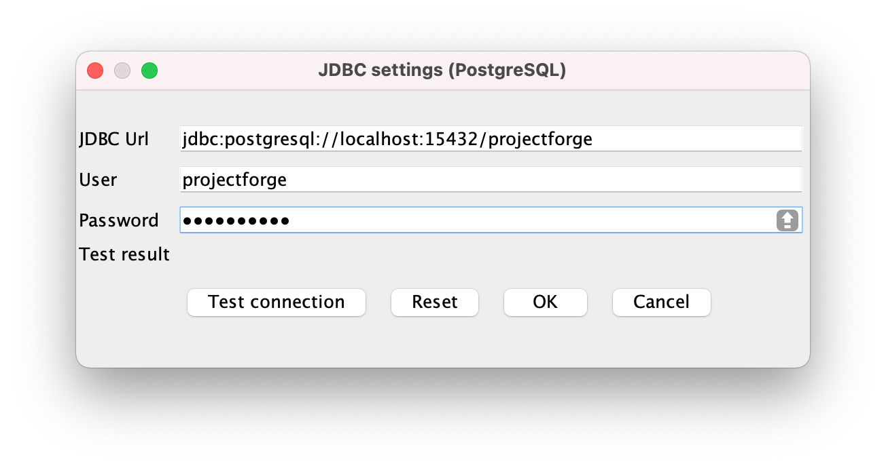

ProjectForge installation documentation
=======================================
Micromata GmbH, Version {version}
:toc:
:toclevels: 4

:last-update-label: Copyright (C) 2021, Last updated

ifdef::env-github,env-browser[:outfilesuffix: .adoc]
link:index{outfilesuffix}[Top]

:sectnums:

== Basic installation
You may choose now between Docker based installation or normal installation.

=== Docker
You may install ProjectForge as docker image.

We assume `/home/projectforge/ProjectForge` as ProjectForge's home in this documentation, but you may choose anything else (will be created or should be empty if already exists).

==== Built-in database (HsqlDB)
For test or small installations you may use the built-in data base.+

1. First start `docker run -t -i -p 127.0.0.1:8080:8080 -v $HOME/ProjectForge:/ProjectForge --name projectforge kreinhard/projectforge`
2. Follow setup wizard below.
3. After finalization of setup, press `CTRL-C` for stopping container.
4. Restart  `docker start projectforge`
5. Enjoy.

==== External data base (PostgreSQL)
For productive and larger installations.

1. Copy and modify https://github.com/micromata/projectforge/blob/master/projectforge-docker/compose/docker-compose.yml[docker-compose.yml] (choose data base password).
2. First start: `docker-compose run projectforge-app`
3. Follow setup wizard below (choose PostgreSQL, data base will be available after some minutes for connection test).
4. After finalization of setup, press `CTRL-C` for stopping container.
5. Restart 'docker-compose up'
6. Enjoy.


==== Java-Installation
If you don't want to use Docker, you're able to install ProjectForge from the executable jar file.

1. Install openjdk-11
2. Get projectForge-application_version.jar
3. First start: java -jar projectForge-application_version.jar

=== The installation setup wizard
After first start, you'll ask for entering the setup wizard. Go for it.
There is an console setup wizard available as well as a graphical wizard as desktop application, depending on your environment. You may choose
the version if your system supports both (graphical output and terminal output).

Both editions have the same functionality.

[#img-setup-wizard-1]
.The setup wizard (terminal edition) for choosing ProjectForge's home directory. This step is skipped on docker based installation.

image::images/setup-wizard-step-1.png[Setup wizard, step 1]

We assume `/home/projectforge/ProjectForge` as ProjectForge's home in this documentation, but you may choose anything else (will be created or should be empty if already exists).

[#img-setup-wizard-2]
.The setup wizard (terminal edition) for configuring the basic settings.
image::images/setup-wizard-step-2.png[Setup wizard, step 2]

[#img-setup-wizard-jdbc]
.The setup wizard (graphical edition) for configuring and testing the data base connection.


You may leave the most settings as they are. You are able to change these settings later in `projectforge.properties` or `config.xml`.

[cols="1,3"]
|===
h|Directory | ProjectForge's home directory including configuration, database and working directory.
h|Domain | The domain of your system (http://localhost:8080 for test systems). This is needed e. g. for sending e-mail-notification to users including direct links to your installation of ProjectForge.
h|Port | ProjectForge starts the server on this port (8080 should be OK for most cases and can't be modified for docker installation).
h|Database | Choose the data base. Embedded uses the built-in data base of ProjectForge (Hsql DB) and should be OK for test, development or small instances. In docker mode only PostgreSQL is available.
h|Jdbc settings|If you choose PostgreSQL you are able to enter the data base connection values and test them by clicking *Test connection*.
h|Currency | The default currency to use.
h|Locale | The default locale to use. Your users are able to choose their own language.
h|First day | The first day of week to use in the calendar views.
h|Time | The default time notation to use (customizable by the users).
h|Setting | Start ProjectForge - If checked, ProjectForge will be started after clicking *Finish*. For embedded data base, the data base is created.
h|Setting | Enable CORS filter - Please check only for development (React development using yarn or npm). Do not use for productive systems!!!
|===

After clicking finish, ProjectForge will be initialized and started. You may proceed with your web browser with `http://localhost:8080` or `https://projectforge.acme.com`.


[NOTE]
====
If your browser doesn't support `http://localhost:8080`, try 'http://127.0.0.1:8080/' or 'http://127.0.0.1:8080/wa/setup' or another browser.
====

ProjectForge is only available on port 8080 from localhost due to security reasons. For using https, please refer <<Reverse Proxy Setup (https)>>.

=== The setup page

[NOTE]
====
Please be aware, that after your first start of ProjectForge, your page might be public and be configured by somebody else! So proceed directly with the configuration if your new ProjectForge instance is
public available.
====

[#img-setup-webpage]
.After starting ProjectForge the first time, a setup page is displayed.
image::images/setup-webpage.png[Setup web page]

[cols="1,3"]
|===
h|Target | Choose *Productive system* for starting with an empty initialized data base. Choose *Test system* for installing a test system with lots of test data.
h|User name | The user name of the initial admin user of ProjectForge.
h|Password | Admin's password.
h|Default time zone | Default time zone for all users, if not configured by an user und MyAccount.
h|Calendar domain | ProjectForge provides calendar and events. For having world-wide unique event id's, choose here your personal name.
h|Administrators | ProjectForge sends e-mails to this address(es) in the case of special errors. You can specify one ore more (coma separated) addresses (RFC822).
h|Feed-back | If this e-mail is given then a feedback panel will be shown if an error occurs. The user has the possibility to send an e-mail feedback (e. g. JIRA-system or help desk).
|===

Just click finish to have your ready-to-use installation.

[#img-setup-webpage-finished]
.After initialization you will get this screen. No restart a last time and also all activated plugins are now fully available.
image::images/setup-webpage-finished.png[Setup finished]


[NOTE]
====
Wait until ProjectForge's initialization is finished and you are requested to restart ProjectForge. After restarting all activated plugins
are also available.
====

=== Activation of built-in-plugins


[#img-setup-webpage]
.You have to activate some built-in plugins if you want to use them. The plugin "Data transfer" is recommended.
image::images/admin-plugins.png[Activation of built-in plugins (Menu Administration -> Plugins)]


== Customization

=== Main configuration file `projectforge.properties`

You'll find an overview of all configuration options here: https://github.com/micromata/projectforge/blob/master/projectforge-business/src/main/resources/application.properties[application.properties]

A minimal set of `projectforge.properties` will be installed automatically by the setup wizard.

Here you may define your company logo.

=== Configuration parameters

You'll find further configuration params through the web application under the menu 'Administration' -> 'Configuration'.

=== Special configurations, file `config.xml`

A minimal set of `config.xml` will be installed automatically by the setup wizard. Here you may define your specific holidays.

== Reverse Proxy Setup (https)

The recommended way of setting up ProjectForge is to use a reverse proxy to do the SSL termination. This document focueses on using the NGINX web server software to  accomplish this.

=== Nginx
==== Prepare

All of the commands below should be run with `root` privileges.

1. Install Nginx: `$ apt-get install nginx`
2. Get an SSL certificate(use only one of the options below)
   a. Create self signed certificate: `$ openssl req -x509 -nodes -days 365 -newkey rsa:2048 -keyout /etc/ssl/projectforge.key -out /etc/ssl/projectforge.crt`
   b. Generate an SSL certificate https://letsencrypt.org/getting-started/[using Letsencrypt], note that the path in the NGINX configuration below needs to be changed when using Letsencrypt.
3. Generate secure Diffie-Hellman parameters for key exchange (this will take a long time): `$ openssl dhparam -out /etc/nginx/dhparam.pem 4096`

===== secure domain for setup through htpasswd (optional)
1. `$ apt-get install apache2-utils`
2. `$ htpasswd -c /etc/nginx/.htpasswd projectforge`

==== Configure Nginx

To use NGINX as a reverse proxy, it's necessary to create a configuration file. The standard path for NGINX configurations is `/etc/nginx/sites-available/`, so let's create the file `/etc/nginx/sites-available/projectforge` with the content listed below.
If you want to use `.htaccess` to blok access to the installation, you need to remove the comment character (`#`) in front of the `auth_basic` and `auth_basic_file` parameters.
If you want to use HSTS (which makes browsers show an error page when the SSL certificate is invalid and/or nonexistent), remove the comment character (`#`) in front of the `add_header Strict-Transport-Security` parameter.

**Remeber to replace *projectforge.example.com* with the actual domain you'll run ProjectForge on!**

[source]
----
server {
  listen 80;
  listen [::]:80;
  server_name projectforge.example.com;
  location / { return 301 https://$host$request_uri; }
}

server {
  listen              443 ssl;
  listen              [::]:443 ssl;
  server_name         projectforge.example.com;
  ssl_certificate     /etc/ssl/projectforge.crt;
  ssl_certificate_key /etc/ssl/projectforge.key;
  ssl on;

  ssl_protocols TLSv1.2;
  ssl_prefer_server_ciphers on;
  ssl_dhparam /etc/nginx/dhparam.pem;
  ssl_ciphers EECDH+AESGCM:EDH+AESGCM;
  ssl_ecdh_curve secp384r1; # Requires nginx >= 1.1.0
  ssl_session_timeout  10m;
  ssl_session_cache shared:SSL:10m;
  ssl_session_tickets off; # Requires nginx >= 1.5.9
  ssl_stapling on; # Requires nginx >= 1.3.7
  ssl_stapling_verify on; # Requires nginx => 1.3.7
  add_header X-Frame-Options DENY;
  add_header X-Content-Type-Options nosniff;
  add_header X-XSS-Protection "1; mode=block";

  #add_header Strict-Transport-Security "max-age=63072000; includeSubDomains; preload";

  location / {
    proxy_set_header        Host $host;
    proxy_set_header        X-Real-IP $remote_addr;
    proxy_set_header        X-Forwarded-For $proxy_add_x_forwarded_for;
    proxy_set_header        X-Forwarded-Proto $scheme;

    proxy_pass              http://localhost:8080;
    proxy_read_timeout      90;
    proxy_redirect          http://localhost:8080 https://projectforge.example.com;

    # auth_basic            "Username and Password Required";
    # auth_basic_user_file  /etc/nginx/.htpasswd;
  }
}
----

To activate the NGINX configuration, you'll need to symlink the configuration file we just created to `/etc/nginx/sites-enabled`. This can be done by using the following command:

```bash
$ ln -sv /etc/nginx/sites-available/projectforge /etc/nginx/sites-enabled/projectforge
```

=== Apache httpd
to be defined.

== Using CardDAV and WebDAV with Milton
Place files `milton.license.properties` and `milton.license.sig` to directory `~/ProjectForge/resources/milton/` and start ProjectForge with
loader path:
```bash
${JAVA} ... -Dloader.path=${HOME}/ProjectForge/resources/milton ${DEBUGOPTS} -jar projectforge-application.jar &
```

== Start ProjectForge (without docker)
1. Start ProjectForge server (e.g. on `http://localhost:8080`, update the NGINX config if you use another port).
2. Follow the configuration instruction (setup wizard in console ui or as Desktop app).
3. (Re-)start Nginx:
3.1. SysVInit: `/etc/init.d/nginx restart`
3.2. SystemD: `systemctl restart nginx`
4. Navigate to ProjectForge with your browser and finalize the setup.

=== Example start-file

```bash
#!/bin/bash

PF_JAR=${HOME}/application/projectforge-application-xxx.jar"

echo "Using ProjectForge jar: ${PF_JAR}..."

if [ "${OSTYPE}" == 'cygwin' ]
then
    JAVA=`cygpath "${JAVA_HOME}"`/jre/bin/java
else
    if [[ -n "$JAVA_HOME" ]] && [[ -x "$JAVA_HOME/bin/java" ]];  then
    	JAVA="$JAVA_HOME/bin/java"
	else
    	JAVA=/usr/bin/java
	fi
fi

echo "Using ${JAVA}"

DEBUGOPTS=

nohup ${JAVA}  -Xms4g -Xmx4g ${DEBUGOPTS} -jar $PF_JAR 2>&1 > /dev/null &
```

=== Example stop-file

```bash
#!/bin/bash

pid=$(pgrep -f "java.*-jar projectforge-application")
if [[ -z $pid ]]; then
    echo "ProjectForge process not found"
    exit 0
else
    kill $pid
fi

echo "waiting 10 sec for termination of pid $pid..."
sleep 10

pid=$(pgrep -f "java.*-jar projectforge-application")
if [[ -z $pid ]]; then
    echo "ProjectForge stopped"
    exit 0
else
    echo "ProjectForge not stopped, now sending sigkill"
    kill -9 $pid
fi

sleep 0.5

pid=$(pgrep -f "java.*-jar projectforge-application")
if [[ -z $pid ]]; then
    echo "ProjectForge killed"
    exit 0
else
    echo "ProjectForge could not be killed"
    exit 1
fi
```

== Adding external plugins
ProjectForge supports external 3rd party plugins:
1. Place your jars e. g. in `/home/kai/ProjectForge/plugins`
2. Tell ProjectForge where it is. You may have to options:
a. Run ProjectForge from command line with option `-Dloader.home=/home/kai/ProjectForge`, or
b. Set the environment variable before starting ProjectForge: `export LOADER_HOME=/home/kai/ProjectForge`.
3. Start ProjectForge and activate the plugin as admin in the ProjectForge's web app under menu Admin->plugins.
4. Restart ProjectForge.

== Backups
=== JCR
Attachments will be handled through the built-in JCR module. The backups are placed in `ProjectForge/backup`, the daily backups will
purged after 30 days keeping each first monthly backup.

=== DB backup
You may configure a purge job in `projectforge.properties`:
```
### If purgeBackupDir is given and exists, ProjectForge will purge daily backups older than 30 days keeping each first monthly backup.
### The filenames must contain the date in ISO format (...yyyy-MM-dd....).
# This is the backup dir to look for:
projectforge.cron.purgeBackupDir=/home/projectforge/backup
# You may optional specify the prefix of the backup files (if not given, all files containing a date in its filename will be processed):
projectforge.cron.purgeBackupFilesPrefix=projectforge_
```
Your daily data base backups should contain the date of backup in ISO format in its file name.
Daily backups (not monthly) will be deleted after 30 days.
Refer config file for all options: [https://github.com/micromata/projectforge/blob/develop/projectforge-business/src/main/resources/application.properties]
